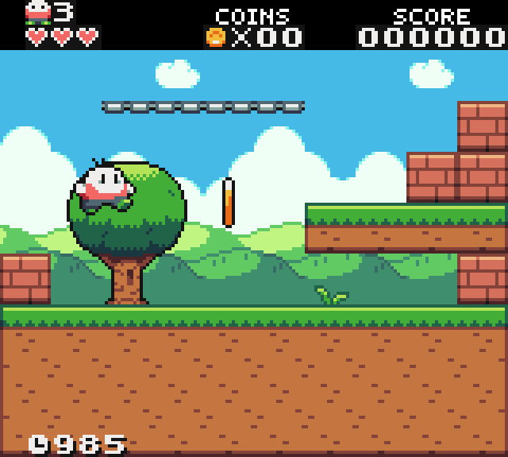

# Details
A simple platformer game using Open Game Art and Pygame-CE. This project is a way to familiarize myself with the Python language, and creating a platformer game using only a library.

## Current Features
* A moving and jumping player using states for input and animation
* A classic retro HUD style is displayed
* 2D tilemap collision and reaction(!!!! Thank you, [Jonathan Whiting!](https://jonathanwhiting.com/tutorial/collision/))
* Loading a single screen game level from CSV (Thank you, [Tiled!](https://www.mapeditor.org/))
* Game time is tracked (though, changing to a Game Over state is not YET implemented...)

## Screenshots
