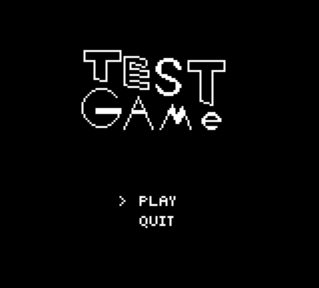
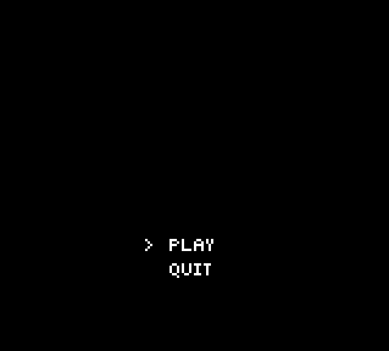

# Details
A simple platformer game using GrafxKid's [Open Game Art](https://opengameart.org/content/arcade-platformer-assets) and [Pygame-CE](https://github.com/pygame-community/pygame-ce).
This project is a way to familiarize myself with the Python language, and creating a platformer game using only a library.

## Current Features
* A moving and jumping player using states for input and animation
* Animated and collectible coins
* Multiple stompable enemies
* A working lives, score, and coin count
* A classic retro HUD style is displayed
* Sound effects and music!
* A level bigger than a single screen(!!)
* A scrolling camera to follow the player
* Death restarts the level
* Reaching the end of the level wins the game
* 2D tilemap collision and reaction(!!!! Thank you, [Jonathan Whiting!](https://jonathanwhiting.com/tutorial/collision/))
* Loading a single screen game level from CSV (Thank you, [Tiled!](https://www.mapeditor.org/))
* Game time is tracked and kills player if timer runs out
* Working Main Menu, Game, Pausing, and Game Over screens

## Gameplay

## Progress Shots

## Post-Mortem Thoughts
This was a really fun way of learning Python and how to build a game from scratch. I've tried something similar to this,
using Tiled to make a Platformer, but I always thought I needed to import a .tmx loader library. Well, I'm here to tell you:
YOU DON'T. Just use CSV! It's so much simpler, and lets you build out how you load in the game yourself! I personally think,
I did fine-ish on how I designed everything, though I think the biggest "Oh man, this is actually pretty bad" is how I do
my camera and pos_rect and world_pos. I originally thought that these need to be seperate things to work properly: pos_rect
is where the entity is on screen, and world_pos is for the position in the world for collision. But having two seperate rects 
made it pretty hard to manage. Though I didn't really consider the design principles, I guess I ended up using Singletons for
the managers. The general design is actually something I learned while messing with Unity in the past, and I'm happy at how
well it works. I also ended up kind of rushing the end, I planned on using Pickup and Enemy Managers, but decided I'd just
use lists to handle everything. I also had original plans of using more enemies and multiple levels, but I'm ready to move on
to a new project. Though I was able to use Tiled to build out the game world and the positions of entities, I feel that if I
wanted to make a more serious project, I should consider building my own HUD builder program, as setting up the HUD by hand was...
not fun lol.

I really have enjoyed my time with python and pygame-ce but if there's one thing that's been kind of troublesome, it's the
distribution of the game that's been a bit of a headache. There's PyInstaller for making an executable, but I can only 
reliably make a distribution for my host PC type, a Linux PC, because I need a Windows or Mac PC to create distributions for
those platforms. There's Pygbag for making a web build, but you have to reshape your project to fit the mold it needs to create a 
web build, and then have to play with some browser REPL to debug any problems.

Which leads me to feel like: if you were going to make a game with intentions of sharing your game to others on the web, it might
be easier to use something else. I think using python and pygame-ce still has merit though for making your first couple of games 
and building up the skills needed to make games from scratch, as it certainly makes it painless and fun to create games, but I feel 
you'll mostly be stuck with just showing local friends and family via your own computer.